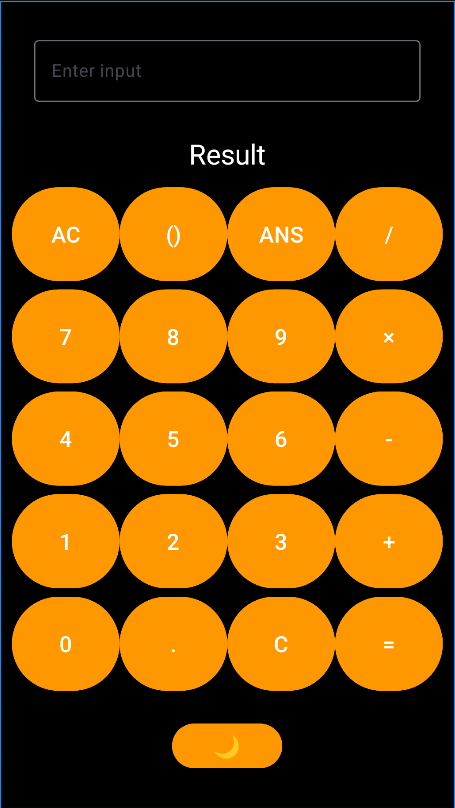

# CalculatorApp

[](https://opensource.org/licenses/MIT)  
A modern, intuitive calculator app built with Android's Material Design principles. This app includes infix expression evaluation, theme toggling (dark/light mode), and a sleek, user-friendly interface.

## 🚀 Features
- **Infix Expression Support**: Evaluate arithmetic expressions in infix notation using Dijkstra's Shunting Yard algorithm for parsing.
- **Dynamic Theme Toggle**: Seamlessly switch between dark mode and light mode with a single tap.
- **User-Friendly Design**: Easy-to-navigate UI with large, responsive buttons and Material Design components.
- **Error Handling**: Robust evaluation mechanism for handling invalid inputs gracefully.
- **Customizable Appearance**: Theme colors can be easily adjusted via `styles.xml`.

---

## 🖼️ Screenshots


---

## 🛠️ Technologies Used
- **Language**: Kotlin
- **Architecture**: Android Jetpack (ViewBinding)
- **UI**: Material Components
- **Evaluation Algorithm**: Dijkstra's Shunting Yard (Implemented in Java)

---

## 📂 Project Structure
```plaintext  
CalculatorApp/  
├── javaCalculator/           # Java implementation of Postfix evaluator  
├── res/                      # Resources (layouts, styles, colors, etc.)  
├── MainActivity.kt           # Main app logic  
├── activity_main.xml         # Main UI layout  
├── styles.xml                # Custom styles for buttons and layouts  
└── README.md                 # Project documentation  
```  

---

## ✨ How It Works
1. **Input Handling**: Users can input numbers, operators, and parentheses using on-screen buttons.
2. **Expression Evaluation**: The app converts the infix input into postfix notation and evaluates the result using a stack-based approach.
3. **Dark/Light Mode Toggle**: A toggle button dynamically changes the app's theme.

---

## ⚙️ Installation
1. Clone this repository:
   ```bash  
   git clone https://github.com/arindam-tripathi/CalculatorApp.git  
   cd CalculatorApp  
   ```  
2. Open the project in Android Studio.
3. Build and run the app on an emulator or physical device.

---

## 📚 Resources
- [Dijkstra's Shunting Yard Algorithm](https://en.wikipedia.org/wiki/Shunting-yard_algorithm)
- [Material Design Guidelines](https://material.io/design)

---

## 🧑‍💻 Contributing
Contributions are welcome! Feel free to open issues or submit pull requests.

---

## 📝 License
This project is licensed under the MIT License - see the [LICENSE](LICENSE) file for details.

---

## 📧 Contact
Created by [Arindam Tripathi](https://github.com/ArindamTripathi619).  
For any inquiries or suggestions, feel free to reach out!

---